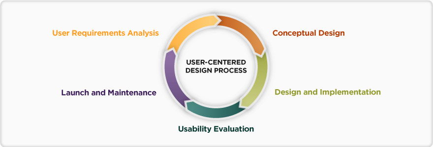

#Estudio contextual sobre videojuegos en la ciudad de colima
Juan Carlos Villalvazo Rodriguez

+++

## Estudio Contextual Videojuego

###Qué es un estudio contextual?

Es un método semi-estructurado para obtener información sobre el contexto de uso, en donde los usuarios son entrevistados y observados en su propio medio ambiente. La información obtenida es más real que si la obtuvieramos en un laboratorio. 

###Objetivo del estudio contextual

El objetivo es conocer a las personas que juegan videojuegos

---

## Estudio Contextual Videojuego

### Metodología utilizada

### Temas observados

* Estatus: bla bla
* Género: bla bla

---

## Estudio Contextual Videojuego

### Estadísticas del usuario

* Lugar: Ciudad de Colima
* Fecha: 1 de Mayo del 2017
* Tecnología empleda: Fotografía digital (Camara del celular Sony Xperia C5 Ultra de 13MP)
* Usuarios entrevistados: 1 usuario.
* Evento que llego a afectar el estudio: N/A

