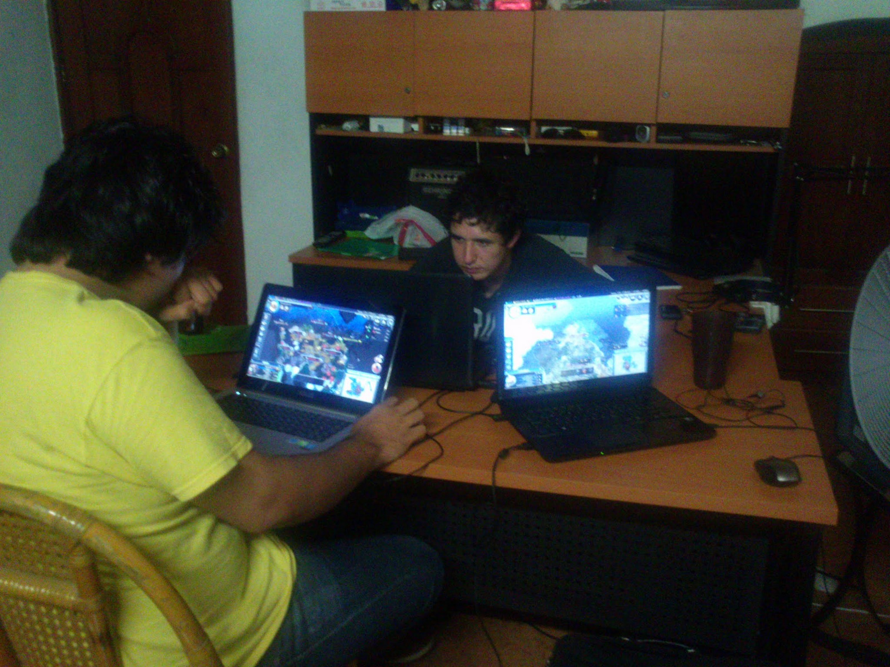
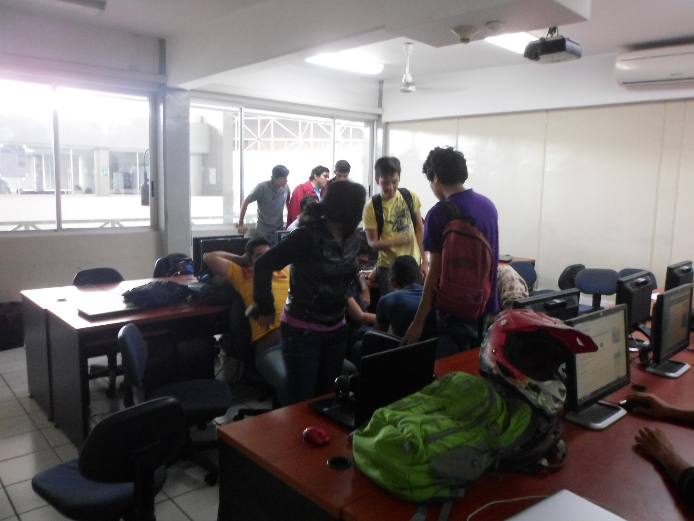
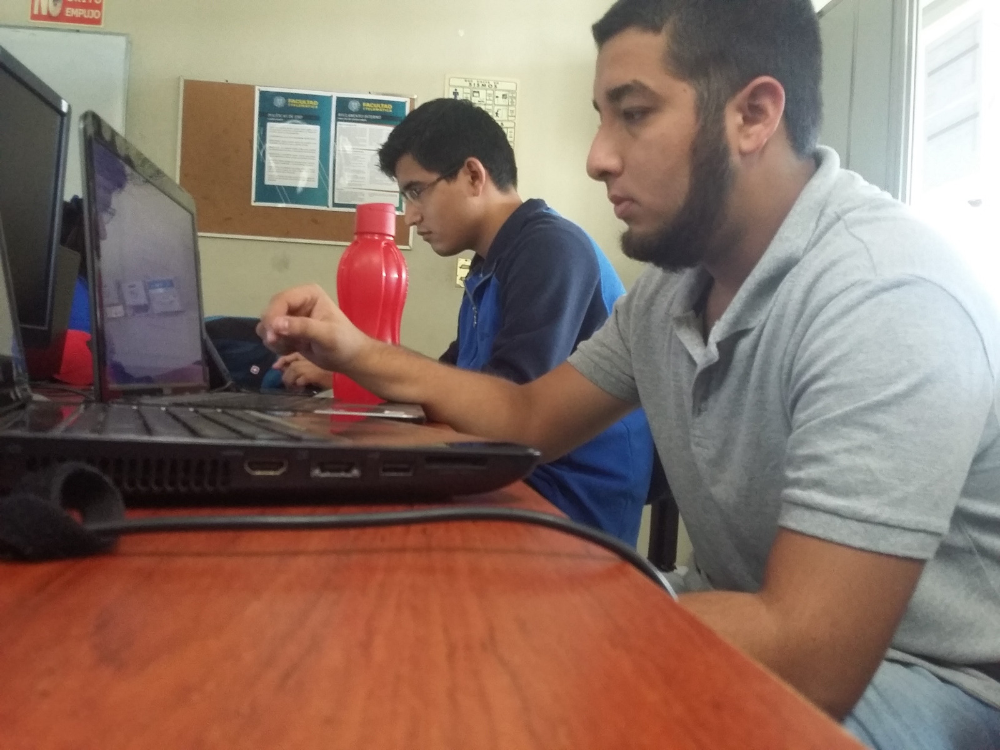
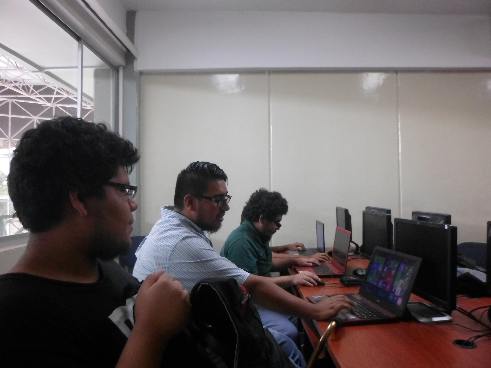

#Estudio contextual sobre videojuegos en la ciudad de colima
Juan Carlos Villalvazo Rodríguez

---

## ¿Qué es un estudio contextual?

Es un método semi-estructurado para obtener información sobre el contexto de uso, en donde los usuarios son entrevistados y observados en su propio medio ambiente. La información obtenida es más real que si la obtuviéramos en un laboratorio.

+++
## Objetivo del estudio contextual

El objetivo es conocer a las personas que juegan videojuegos

---

## Metodología utilizada

---

## Estadísticas del usuario

* Lugar: Ciudad de Colima
* Fecha: 1 de Mayo del 2017
* Tecnología usada: Fotografía digital (Cámara del celular Sony Xperia C5 Ultra de 13MP)
* Usuarios entrevistados: 1 usuario.
* Evento que llego a afectar el estudio: N/A
---
## Uso de video juegos

+++

+++

+++

+++

---

### Estudio contextual sobre videojuegos en la ciudad de colima
Juan Carlos Villalvazo Rodríguez
villalvazo_rodriguez@ucol.mx